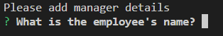
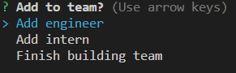
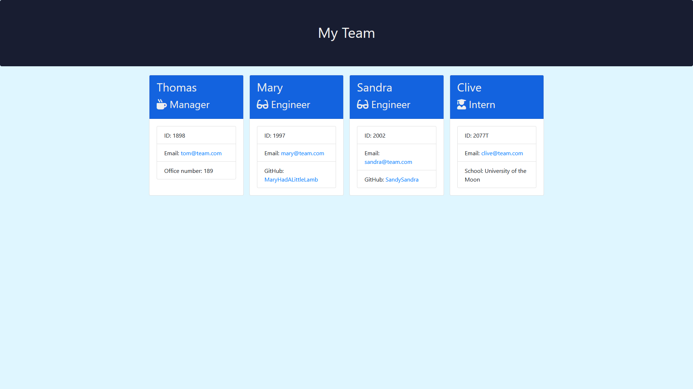

# Team Profile Generator

## Table of Contents

1. [URL](#url)
2. [Description](#description)
3. [Installation](#installation)
4. [Usage](#usage)
5. [Credits](#credits)

## URL 

The repository for this project can be found at
https://github.com/Spacepineapple/team-profile-generator. Please note that as
this programme uses Node.js, it has not been deployed and there is no URL for
the 'live' programme.

## Description 

This project is my solution to the ninth challenge task of a web development
bootcamp. For this task, I was provided with starter code containing tests,
empty class files and an index.js file with code to import the classes and
relevant packages. I was tasked with creating a command-line application that
generated a profile of a company team. This application need to accept user
input and generate an HTML file based on this input, although the functionality
to generate the page was provided for me. 

As a command-line application, this programme requires the use of the command
line or terminal. Instructions for installing any necessary software and opening
the application can be found below. After successfully opening the application,
the user should see be prompted with a question as can be seen in the image
below:

After answering each question for the initial employee (i.e., the manager), the
user will then be prompted to add additional employees to the team by selecting
from a menu. Options include adding an engineer, adding an intern or finishing
building the team as can be seen in the image below:

A user may add as many additional team members as they like by selecting the
relevant option and answering the prompts. After the user has finished, they can
then select "Finish building team" to generate an HTML page showing their team
profile. This page will be generated in the output folder within the repository
alongside a style.css page. Note that if no such folder exists, one will be
created when the "Finish building team" option is selected. Upon successful
completion of the page generation, a console message will appear in the command
line confirming that the HTML and CSS files have been generated. Should the
process fail, the resulting error will be logged to the command line instead.

An example team profile can be found in the "output" folder of this repository
and a screenshot of this page is also shown in the image below:

## Installation 

This file requires Node.js and the inquirer package. Node.js can be installed
from https://nodejs.org/en/ and the inquirer package can be installed using the
Node Package Manager and the command: "npm install inquirer@8.2.4". Please note
that subsequent versions of inquirer require the ES6 import/export syntax. Due
to the use of Jest for this project and the difficulties associated with the ES6
syntax in Jest, this project does not use this syntax and subsequent versions of
inquirer will not function as expected.

## Usage 

To use this programme, first download the repository contents including all of
the source code and if necessary, extract the files if in a zip format.
Following this, open the command line or terminal and navigate to the folder
containing the unzipped files. Type "node index.js" (without the speech marks)
and answer each of the questions in the terminal by typing an answer. Please
note that for the question around adding an engineer, intern or finishing
building the team, you will need to select an option from the list -- this can
be done using the up and down arrow keys and hitting return or enter when the
highlighted option corresponds to the option you wish to choose. Following this,
the generated index.html file can be found in the output folder within the
repository.

## Credits 

This team profile generator was produced by myself using starter code provided
by EdX as part of their Front End Web Development bootcamp. The starter code
included all of the test files, as well as the code in the page-template.js file
and some empty pages with guidance comments to assist in the creation of classes
and importing/exporting module data. All code written in the Employee, Engineer,
Intern and Manager class files, the page-styling file and index.js was written
by me with the exception of the initial lines in index.js up to the definition
of the const renderTeam variable. Additionally, the generated html files use
icons which I had no role in designing.
